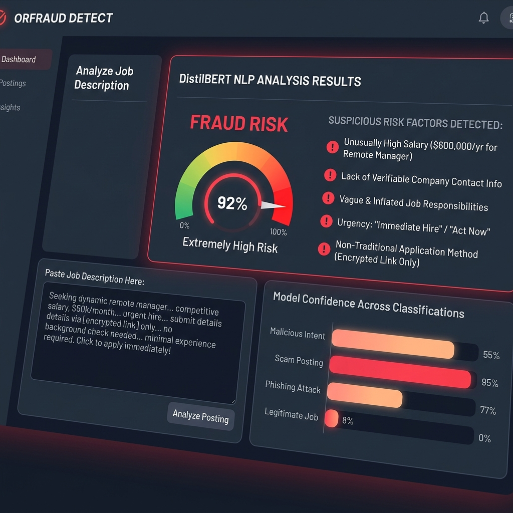

# Online Recruitment Fraud Detection using Transformer-Based Deep Learning 🔍🚫


An end-to-end NLP and Deep Learning project that enhances the detection of online recruitment fraud using a fine-tuned DistilBERT transformer model. It features an interactive **Streamlit** telemetry dashboard allowing users to input a job posting description and receive a real-time fraud probability score.

---

## 🖥️ Live Telemetry Dashboard


---

## 🌟 Key Features

1. **Transformer NLP Classification**: Fine-tuned **DistilBERT** classification model using PyTorch and Hugging Face `transformers` library for state-of-the-art text representation and classification.
2. **Class Imbalance Mitigation**: Implements sampling and weight adjustment strategies (utilizing `imbalanced-learn`) to handle the highly imbalanced nature of real-world recruitment scam datasets.
3. **Interactive Streamlit Web Interface**: Paste any job description to evaluate its safety score. The dashboard instantly computes a fraud risk percentage and displays analysis metrics.
4. **Comprehensive Data Exploration**: Visualizes exploratory data analysis (EDA), training history plots (loss and accuracy curves), and model evaluations (confusion matrices and ROC curves).
5. **Multi-Model Strategy Comparison**: Compares the fine-tuned Transformer model performance with classical ML algorithms (e.g. Random Forest, Logistic Regression).

---

## 📂 Project Structure

```text
├── fake_job_detector_model/    # Fine-tuned DistilBERT PyTorch weights & config files
├── assets/                     # Screenshots and visual media
│   └── detector_dashboard.png  # Streamlit dashboard preview
├── webapp.py                   # Streamlit web interface and inference script
├── fake_job_detection.py       # Core pipeline: data prep, training loop, and evaluation
├── data_exploration.png        # Dataset visualization charts
├── training_history.png        # Training loss/accuracy curve charts
├── model_evaluation.png        # Confusion matrix and ROC curves
├── fake_job_postings.csv       # Training dataset containing text job descriptions
├── requirements                # Package dependencies
└── strategy_comparison.csv     # Model evaluation results comparing ML approaches
```

---

## ⚙️ Installation & Setup

1. **Clone the repository**:
   ```bash
   git clone https://github.com/SandeepTech11/Enhance-online-recruitment-fraud-dection-using-transform-based-deep-learning-model.git
   cd Enhance-online-recruitment-fraud-dection-using-transform-based-deep-learning-model
   ```

2. **Install dependencies**:
   ```bash
   pip install pandas numpy matplotlib seaborn scikit-learn transformers torch imblearn nltk streamlit plotly
   ```

3. **Train / Evaluate the Model**:
   ```bash
   python fake_job_detection.py
   ```

4. **Launch the Dashboard**:
   ```bash
   streamlit run webapp.py
   ```
